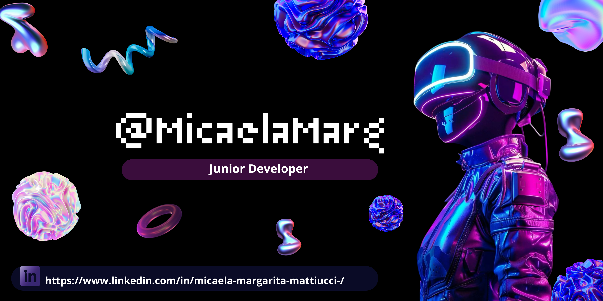
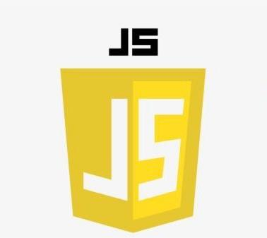
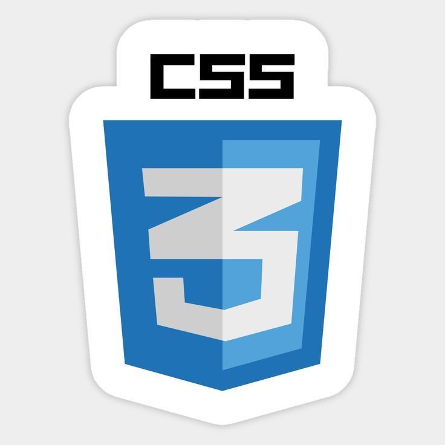
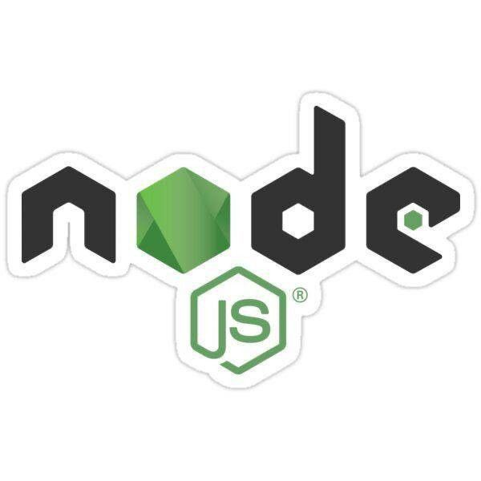
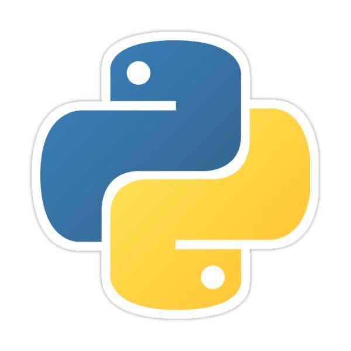
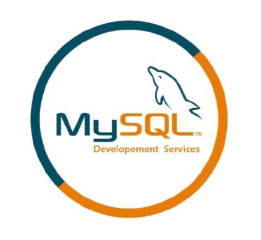
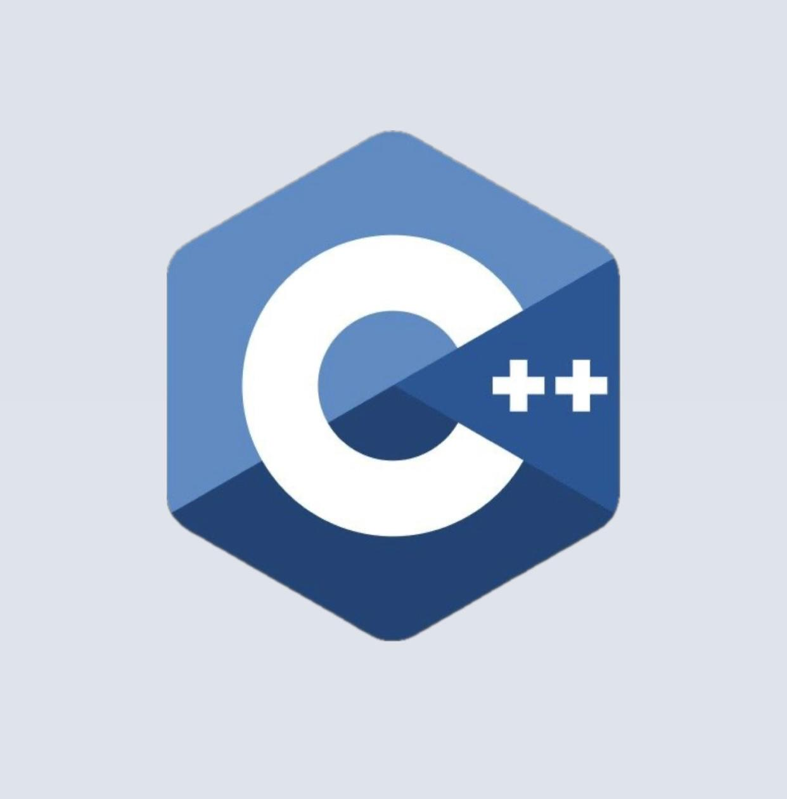
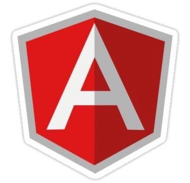
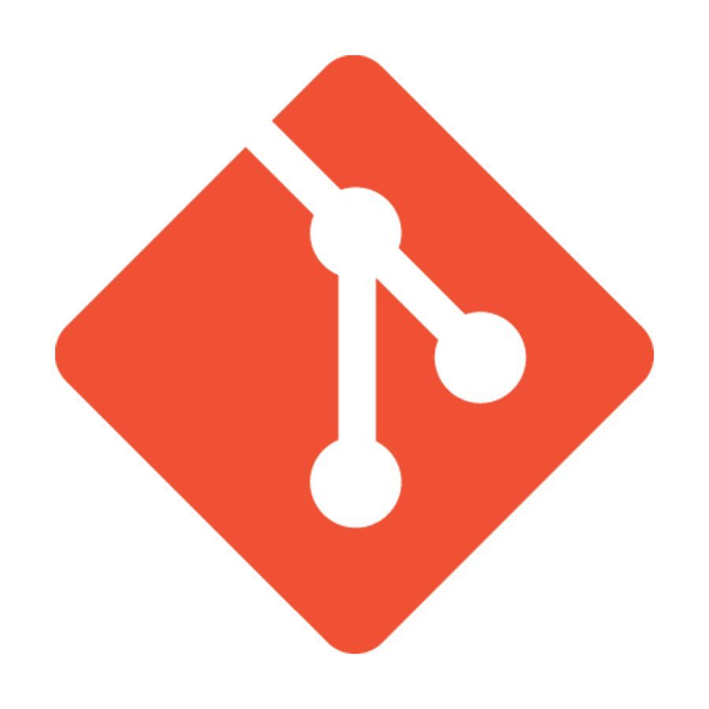

<h1 align="center" > 
  Hello, I'm Micaela Mattiucci
</h1>

<h3 align="center">Junior Full-Stack Web Developer | Passionate About Scalable Code and User-Centered Design</h3>

---

  

---

### 🛠 Technical Skills

  
  
  
  
   
  
   
   
   
   
  
  

---

<h2 align="center" style="display: flex; align-items: center; justify-content: center; gap: 15px;">
  
  Junior Full-Stack Web Developer
</h2>

  I am a <strong>junior full-stack web developer</strong> with experience in both frontend and backend technologies.  
  I am dedicated to building efficient, responsive, and user-friendly web applications with clean, scalable code.

<ul style="max-width: 700px; margin: auto; font-size: 18px; line-height: 1.6;">
  <li>🔹 On the <strong>frontend</strong>, I focus on creating accessible and intuitive interfaces using HTML, CSS, JavaScript, and modern frameworks.</li>
  <li>🔹 On the <strong>backend</strong>, I have experience working with server-side logic, APIs, and database integration.</li>
  <li>🔹 I am committed to continuous learning and eager to contribute to collaborative development teams.</li>
</ul>

### 📫 Let's Connect

- [LinkedIn](https://www.linkedin.com/in/micaela-margarita-mattiucci-/)
- [Portfolio](https://micaelamattiucci.github.io)
